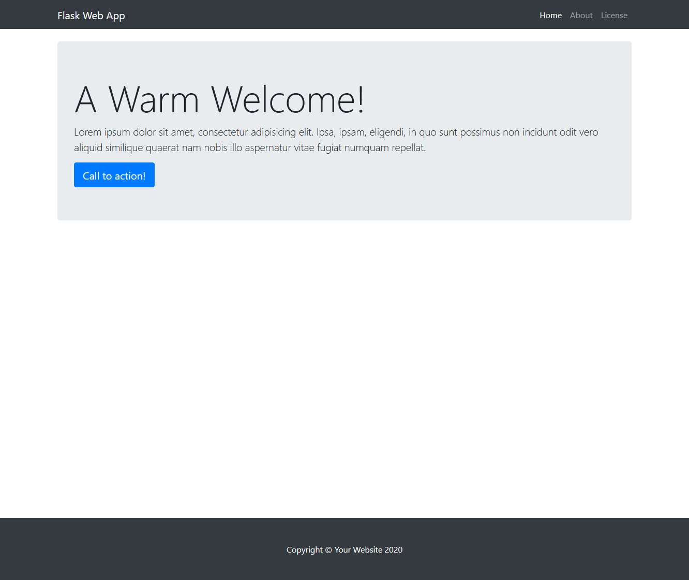

## Flask Template

- [Overview](#overview)
- [Media](#media)
- [Requirements](#requirements)
- [Setup](#setup)
- [License](#license)

<a name="overview"/></a>
## Overview
This repository serves as a template for a basic web application built using [Flask](https://flask.palletsprojects.com/en/1.1.x/) in Python.

<a name="media"/></a>
## Media


<a name="requirements"/></a>
## Requirements
- [ ] Git
- [ ] Python3
- [ ] Postgres
- [ ] An IDE of your choice

<a name="setup"/></a>
## Local Setup
1. Clone the repository.
```
$ git clone git@github.com:Kyle-L/Flask-Template.git
```

2. Check into the cloned repository.
```
cd Flask-Template/project
```

3. Install Pipenv using pip, install pip if you haven't already.
```
pip install pipenv
```

4. Setup a virtual environment with Pipenv.
```
$ python3 -m venv env
```

5. Start the virtual environment
```
$ source env/bin/activate
```

6. Install the requirements
```
$ pip3 install -r requirements.txt
```

7. Set environment variables.
```
$ export FLASK_APP=app
$ export FLASK_DEBUG=1
```

8. Setup Postgres database using Flask-SQLAlchemy.
```
$ python3
>> from app import db, create_app
>> db.create_all(app=create_app())
>> exit()
```

9. Run the server.
```
$ flask run
```

<a name="license"></a>
## License
[](LICENSE)
